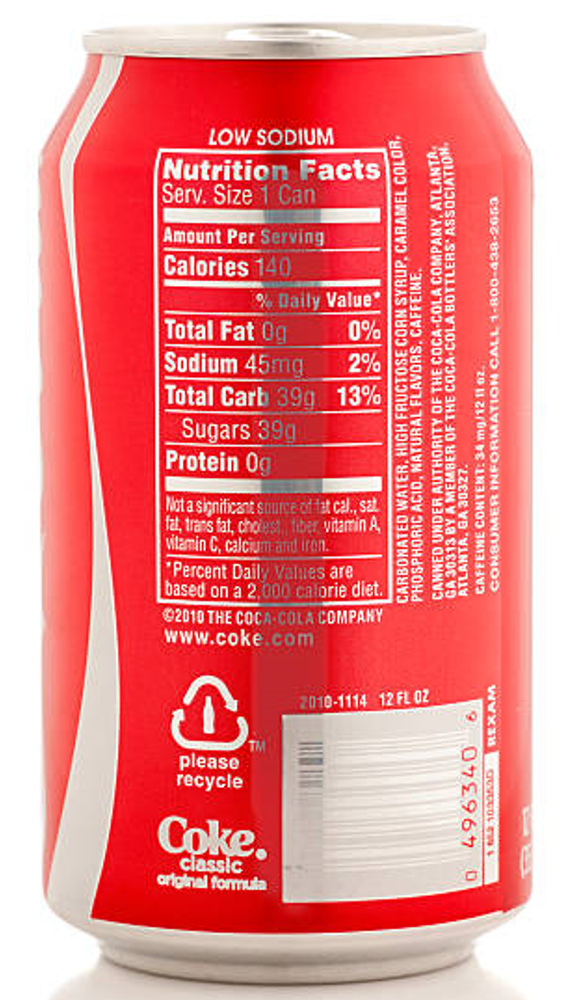
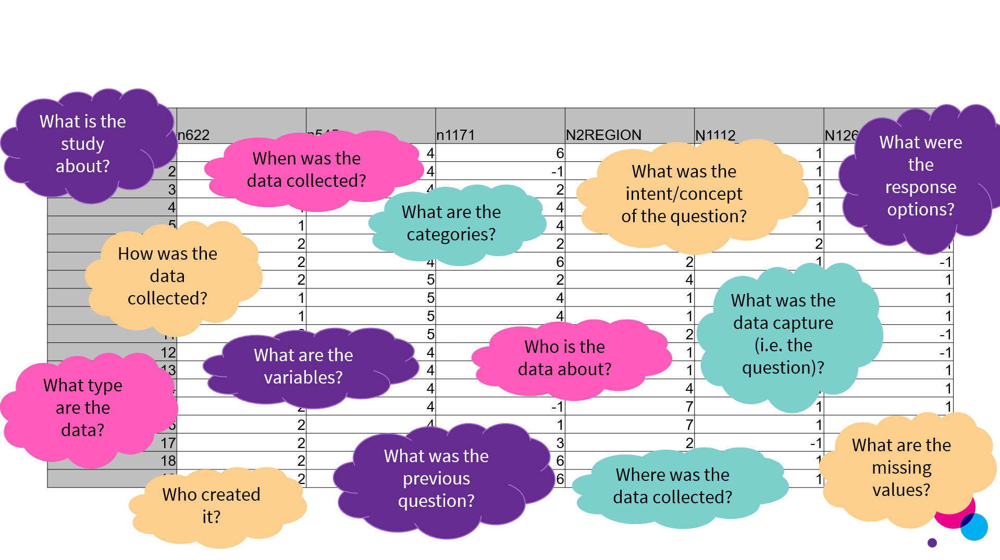

## Intended learning outcome

- Understand what metadata is
- Importance of metadata for you and your research
- Benefits of creating and using metadata

::: notes

This part of the workshop will explain what metadata is, why it’s important, and what the benefits are to you as a researcher

:::

---

## Outline 

[to be updated once deck complete]
- What is metadata?
- Metadata in everyday life
- What information is needed to understand and use data?
- Roles of metadata
- Why is metadata important?
- Benefits of metadata
- Summary

::: notes

:::

---

## A mystery can drink ... a metaphor

Imagine it's a hot day and you're very thirsty. You come across this sealed can on the side of a road ...

Do you know what's inside the can? Would you want to drink it?

---

## A mystery can drink ... a metaphor

Because the can doesn't have a label we don't know ...
- What's inside 
- Where it's come from
- When it was made or by who

It's unlikely that anyone will want to drink from that can and if they do, it's a risk!

---

## A mystery can drink ... explained

Alternatively, if you came across this can in a local supermarket, would you know what is inside it? Would you be happy to drink it?

 

---

## A mystery can drink ... explained

Most people would be more confident about what is inside the can as the packaging contains:

- The brand
- Description of the drink/flavour
- Ingredient list
- Nutrition
- Location of production

Additionally, if the drink was stocked in shop you knew and trusted, you would be more likely to want to drink it than if you found it on the side of the road. The drink would also be stocked alongside other similar soda drinks so you could read the labels, compare drinks and make an informed decision about the drink you pick.

---
## How does the can relate to metadata ...

Imagine the liquid inside the can is a dataset. 

The information about the drink (the brand, location of production, ingredient list, nutrition etc.) is the metadata which tells us what the dataset is. 

Like the plain can, without any metadata, we cannot know what the dataset consists of or the contextual information like who conducted the research and when.

Similar to storing the can in the supermarket and comparing it with other cans, metadata repositories allow us to store metadata for different datasets in the same place. This allows us to search and compare across different datasets, seeing what data is most relevant for us as well as increase the trustworthiness of the data.

Let's consider this in a research context ...

---

## Understanding a dataset

If you were presented with this dataset, what would you need to know in order to understand and use the data?

|          | N662   | N545  | N1171  | N2REGION | N1112  | N1261 |
|----------|--------|-------|--------|----------|--------|-------
| 1        | 2      |  4    | 6      | -2       | 1      | 1            
| 2        | 1      |  4    | -1     | 1        | 1      | 1        
| 3        | 1      |  4    |  4     | 10       | 1      | 1 
| 4        | 1      |  4    |  4     | 4        | 1      | 1  
| 5        | 1      |  4    |  4     | 4        | 1      | 1  
| 6        | 2      |  4    |  2     | 1        | 2      | 1  
| 7        | 2      |  4    |  6     | 2        | 1      | -1  
| 8        | 2      |  4    |  2     | 4        | 1      | 1  
| 9        | 1      |  4    |  4     | 1        | 1      | 1  
| 10       | 1      |  4    |  4     | 1        | 1      | 1  
| 11       | 2      |  4    |  3     | 2        | -1     | -1  
| 12       | 2      |  4    |  -1    | 1        | -1     | -1  
| 13       | 1      |  4    |  3     | 1        | 1      | 1  
| 14       | 2      |  4    |  2     | 4        | 1      | 1  
| 15       | 2      |  4    |  -1    | 7        | 1      | 1  
| 16       | 2      |  4    |  1     | 7        | 1      | 1  
| 17       | 2      |  4    |  3     | 2        | -1     | 1  
| 18       | 2      |  4    |  6     | 2        | 1      | 1  
| 19       | 2      |  4    |  6     | 10       | 1      | 1  

::: notes

- Let’s have a look at more of a contextualised example of how metadata can help us to understand and use data.
- On the slide is a screenshot of a dataset. 
- With the people on your table, please take a couple of minutes to discuss what information you would need in order to be able to understand and use this data.

*Study: [National Child Development Study](https://closer.ac.uk/cross-study-data-guides/cognitive-measures-guide/ncds-cognition/ncds-age-7-copying-designs-test/)
Sweep: [Age 7 Survey (1965)](https://discovery.closer.ac.uk/item/uk.cls.ncds/0103e4b4-09a6-41a8-997b-3ca0b1edcafc)
Data file: [NCDS1 Parental Questionnaire (1965) Dataset](https://discovery.closer.ac.uk/item/uk.cls.ncds/4e8b2fc7-00bd-4783-8445-ef451de69cf5/1)*

:::

---

## Some questions that might be asked to understand and use data

---

## Metadata: answering essential quesitons

Through answering these questions, we start to create the metadata for this data.

Metadata describes data, giving us the context we need to understand and interpret the data.

As a starting point, metadata can be considered as the who/what/where/when/why/how of the data. 
- **Who** collected the data? 
- **What** data did they collect? 
- **When** was it collected? 
- **Where** was it collected? 
- **Why** was it collected? 
- **How** was it collected?

---

## Dataset with more information

Here is the dataset again with more information

_[Provide the above dataset with metadata
- need to find variable labels but can't on CLOSER study page
- also include study level information ]_

|          | N662   | N545  | N1171  | N2REGION | N1112  | N1261 |
|----------|--------|-------|--------|----------|--------|-------
|          | N662   | N545  | N1171  | N2REGION | N1112  | N1261 |
| 1        | 2      |  4    | 6      | -2       | 1      | 1            
| 2        | 1      |  4    | -1     | 1        | 1      | 1        
| 3        | 1      |  4    |  4     | 10       | 1      | 1 
| 4        | 1      |  4    |  4     | 4        | 1      | 1  
| 5        | 1      |  4    |  4     | 4        | 1      | 1  
| 6        | 2      |  4    |  2     | 1        | 2      | 1  
| 7        | 2      |  4    |  6     | 2        | 1      | -1  
| 8        | 2      |  4    |  2     | 4        | 1      | 1  
| 9        | 1      |  4    |  4     | 1        | 1      | 1  
| 10       | 1      |  4    |  4     | 1        | 1      | 1  
| 11       | 2      |  4    |  3     | 2        | -1     | -1  
| 12       | 2      |  4    |  -1    | 1        | -1     | -1  
| 13       | 1      |  4    |  3     | 1        | 1      | 1  
| 14       | 2      |  4    |  2     | 4        | 1      | 1  
| 15       | 2      |  4    |  -1    | 7        | 1      | 1  
| 16       | 2      |  4    |  1     | 7        | 1      | 1  
| 17       | 2      |  4    |  3     | 2        | -1     | 1  
| 18       | 2      |  4    |  6     | 2        | 1      | 1  
| 19       | 2      |  4    |  6     | 10       | 1      | 1  

---

## Why is it important that we have this metadata?

Without this data, we wouldn't be able to understand the dataset. We would have to contact people or organisations so we could get further information about what the dataset is and what it conveys. 

By using metadata we are able to:
- Understand data efficiently and effectively
- Assess how relevant the data is for us
- Compare the dataset with other datasets
- Reproduce or reuse the data
- Save time by not having to contact people for basic information around the dataset

::: notes

- This example shows us how metadata is necessary to understand someone else’s data, but it’s also good to consider how this information might be useful for your future self when working on your own data, so you don’t end up in a Sam1 situation!
- Capturing this information (or metadata) means that the data is available for re-use, and it also makes it machine-actionable to make data management easier and more efficient, and the data more discoverable. 

:::

---

## Defining metadata

Drawing from the example, how do we define metadata ...

- Metadata is a form of data documentation 
- People often descirbe metadata as “data about data” [2]
- Provides a framework to describe and understand data, so that it can be used in an intelligent and meaningful way
  
_“Metadata is structured information that describes, explains, locates, or otherwise makes it easier to retrieve, use, or manage an information resource. Metadata is often called data about data or information about information.” *_

::: notes

If you’ve heard of metadata before, you’ll have likely heard the definition “data about data”.
Wikipedia has a slightly different take… (e.g. the date and time of a text message is metadata, but the text of that message is not)

(2) https://dataedo.com/kb/data-glossary/what-is-metadata
(3) Wikipedia “data that provides information about other data, but not the content of the data itself” [3] -- https://www.britannica.com/technology/metadata
(4) Parry, K. (2023). Metadata Is Not Data About Data. Decolonizing Data, p15-33
* National Information Standards Organization 
http://www.niso.org/publications/press/UnderstandingMetadata.pdf 

:::

---

## Defining metadata as a subset of data documentation

However, what makes metadata different from other forms of data documentation?
Consider these two descriptions of a dataset. 

_[textual description of metadata] // [structured metadata]_

Both contain the same information. However, which format is most effective for data management?

Why?

---

## Defining metadata

  - Metadata is **structured documentation** that is **machine-readable**
  - For metadata to be machine readable, it must be structured according to a specific set of rules
    
  - By being structured and machine-readable, metadata:
    - Standardises the content and structure of documentation, making it easier for computers to extract information from the metadata
    - Tells a computer what something is, how it relates to other things (“objects”), and what to do with it
    - Makes data management for researchers easier and more efficient, saving time and imrpvoing accuracy
    - Allows researchers to quickly discover, understand and access data
    - Helps your future self to understand your past research, preserving your data for continued use

::: notes

*Note*: A schema is a formal technique for organizing metadata

:::

---

## By being structured and machine-readable, metadata allows us to ...

- Store our data in data repositories
  
- Search data repositories/archives
  [screenshot of filters in a repository]
  
- Compare studies 

Metadata provides information enabling us to make sense of 
 - data (e.g. documents, images, datasets)
 - concepts (e.g. controlled vocabularies, classification schemes)
 - real-world entities (e.g. people, organisations, places)
 - processes (e.g. data collections, archiving, computation)

---

## 3 main purposes of metadata

- Metadata supports three main uses:
  - Understandability and context - it helps to convey the meaning of resources
  - Use and action - it describes the limits of reasonable use or what actions can be taken
  - Discovery - it helps people to find relevant resources

::: notes

:::

---

## Metadata and FAIR

Thinking back to FAIR data principles, consider how metadata underpins each principle:

- Findable
- Accessible
- Interoperable
- Reusable

We will recap the specific role in each of the FAIR principles

---

## Metadata and FAIR - FINDABLE

FINDABLE makes it easier to discover and understand data.
- F1. (Meta)data are assigned a globally unique and eternally persistent identifier.
- F2. Data are described with rich metadata.
- F3. Metadata clearly and explicitly include the identifier of the data they describe
- F4. (Meta)data are registered or indexed in a searchable resource.

::: notes
https://www.go-fair.org/fair-principles (for next three slides)
:::

---

## Metadata and FAIR - Accessible

ACCESSIBLE makes it easier to understand how to access the data. 
- A1. (Meta)data are retrievable by their identifier using a standardised communications protocol (open, free, universally implementable, allows for an authentication and authorisation procedure where necessary)
- A2. Metadata are accessible, even when the data are no longer available
- _Note: data does not need to be open but metadata should be accessible._
  
---

## Metadata and FAIR - Interoperable

INTEROPERABLE allows you to combine datasets for further research.
- I1. (Meta)data use a formal, accessible, shared, and broadly applicable language for knowledge representation.
- I2. (Meta)data use vocabularies that follow FAIR principles.
- I3. (Meta)data include qualified references to other (meta)data.

---

## Metadata and FAIR - Reusable

RE-USABLE enables re-use of your own data and re-use for others.
- R1. (Meta)data are richly described with a plurality of accurate and relevant attributes
    - (Meta)data are released with a clear and accessible data usage license.
    - (Meta)data are associated with their provenance.
    - (Meta)data meet domain-relevant community standards.

---

## How do you feel about FAIR?

Test your confidence with FAIR and metadata awareness with Data Archiving and Networked Services [Fair Aware tool](https://fairaware.dans.knaw.nl/)

---

## Benefits of metadata 

For people creating metadata, metadata:
- Preserves your data and research
- Makes data management processes more robust and efficient
- Enables more accurate, reliable and higher-quality research results
- Helps your future self understand and reuse the data
- Helps others find, understand, compare, and use your data
- Increases the visibility of your study to other researchers and organisations
- Exploits the full potential of your data by supporting cross study and secondary research processes

For people using metadata:
- Data is easier to find and assess
- Easier to understand how to access and use the data
- Supports people conducting cross-study and secondary research

For research as a whole:
- Saves time for people working across the research field
- Provides proof of transparent and valid conduct
- Implements FAIR data principles
- Enacts best practice in research

::: notes

As well as external factors, metadata is helpful for your future self, to help you understand your data later down the line, and be able to share it in a meaningful way with others.

:::

---

## Why create metadata?

Metadata is the core component of Research Data Management (RDM) and should be included in all Data Management Plans (DMPs). 

We have already discussed how metadata increases research efficiency and data quality, why else should we create metadata?

- As metadata is a powerful tool and best practice for research, it may be **required** by other organisations such as ...
  - Institutes (in your working contract or project agreements)
  - Funding agencies (ensure reusability and meet FAIR requirements)
  - Journals (as a condition for publishing)
  - Supervisors (data citation to enhance researcher reputation)
  - Projects (collaboration across agencies/organisations)
 

::: notes

:::

---

## In short ...

Metadata allows you to realise the full potential of your data, increasing it's value and making it go further.

---

## Want to know more ...

If you would like further explanation as to what metadata is, what [this knowledge clip from UGent University](https://www.youtube.com/watch?v=DW2T_cnqKPU) to gain an overview of metadata in a research context.

---

## Summary

- Metadata is information that describes data
- Metadata is based on a structure that can be processed by a computer 
- Metadata is important for your future self and others to discover, understand and use data
- Metadata allows researchers to use data effectively because it includes the important information needed to exploit the full potential of data

::: notes

:::

