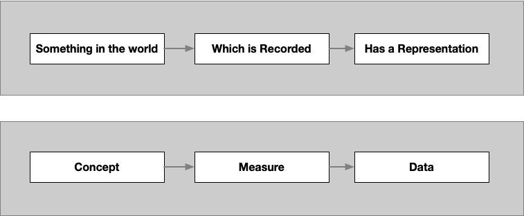
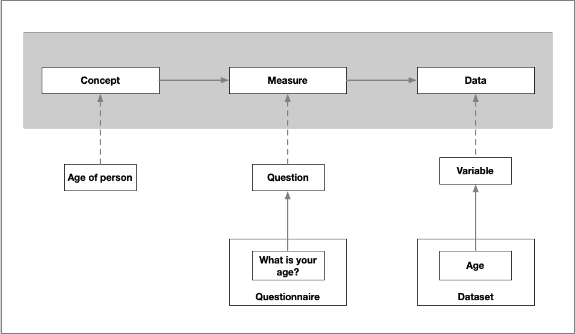

## Intended Learning Outcome
- Understand the characteristics of data
- Understand the purpose of data in research

---

## Outline [#trainer]
- What is data?
- Definition of data
- Data in research
- Introduction to example cast study

---

## What is data?
We use the term data all the time, but what do we actually mean?

---
## Data is everywhere ...

We consume data all the time. Take your weather app for example:


What data is available when we check the weather?

---

## Weather data ...

 


---

## What makes these data?

- Data can be:
  
  - Numbers e.g. 16*
  - Text e.g. 'Sunny conditions will continue all day. Wind gusts up to 12mph.'
  - Symbols e.g. ☀️
 
- Data can also be ...
 - xxx

But what are the characteristics of data that differentiates from them being *just* numbers, words and symbols?

::: notes [#Trainer]
Ask the participants to take 5 minutes to discuss and come up with some thoughts
Collect responses from participants
:::

---
## Characteristics of data

We thought of:

- Has a label e.g. column name
- Has an identifier (person or organisation)
- Can be other things like text
- Could have a domension (weight, height, colour)
- Is consistent in the data type used, all numbers, all text

---

## Data Definition [#Overview]

Data has different definitions in different contexts and disciplines.

What does Wikipedia tell us data is?

"Data is a collection of discrete or continuous *values* that convey *information* describing the *quantity, quality, fact, statistics*, or other basic units of meaning, or sequences of *symbols* that may be further interpreted *formally*"

---

## Data in research [#Overview]

Data in research has a specific meaning and purpose:

- Data that are used as primary sources to support technical or scientific enquiry, research, scholarship, or  artistic activity, and that are used as evidence in the research process and/or are commonly accepted in the research community as necessary to validate research findings and results. 

::: notes
CODATA, https://codata.org/rdm-
:::

---

## Data as a research object

- Data is a representation of something in the world, that has been captured in a specific way

  ``` mermaid
  
  flowchart LR
    sitw(Something in the world) --> Rec(Which is recorded)
    Rec --> Rep(Has a representation)

- If data is the representation, what could the first two boxes be?

   ``` mermaid

    flowchart LR
      Q1(?) --> Q2(?)
      Q2 --> Rep1(Has a representation)
  


::: notes

:::

## Data as a research object

Through this course, we will use the terms: Concept, Measure and Data

  ``` mermaid

  flowchart LR
    C(Concept) --> Me(Measure)
    Me --> Rep(Has a representation)

  ```



---

## Weather data 

- Going back to the weather data we look at at the start of the course, fill in the blank research data flow:


---

## Weather data 


- You may have got the same or you might have looked at wind gusts or percipitation. For example:


- Depending on the focus of your research, the Concept, Measure and Data will be different.
  
---

## Data as a research object

Here is another example:


.one-third-right[
 
]
.one-third-left[

]
---

## Practice [#worksheet]

Congratulations! You’re the newest member of a longitudinal research team at University College London.
The research is funded by UK Department for Young people and the Economic and Social Research Council. The research is looking into the impacts of social media on young people in Onglond.
They have already completed two Waves, collecting data from 437 participants aged 11-16 year olds. through questionnaires WAVE 1 was completed in 2021 and WAVE in 2023. There 
You will conduct the next wave of research in two months time. For this wave, you have to design and deliver a questionnaire.

---

## Practice [Worksheet]

In the questionnaire, you will need to find out how long the pariticipant spends on social media a day.

Fill out the Concept, Measure and Data boxes for this research query.


``` mermaid

flowchart LR
    B1(            ) --> B2(             )
    B2 --> B3(             )

---

## Application

Fill out the Concept, Measure, Data boxes for your dataset.

``` mermaid

flowchart LR
    C(Concept) --> Me(Measure)
    Me --> Rep(Has a representation)

```

``` mermaid

flowchart LR
    B1(            ) --> B2(             )
    B2 --> B3(             )

---

## Further learning [#Overview]

Explore these trainings modules to develop your knowledge of Research Data:
- Mantra: Research Data in Context https://mantra.ed.ac.uk/researchdataincontext/
- Queen Mary's: Research Data Management: Research Data explained (access as a guest) https://qmplus.qmul.ac.uk/mod/scorm/view.php?id=414426

---

## Test your knowledge

---

## Test your knowlesge (answers)
