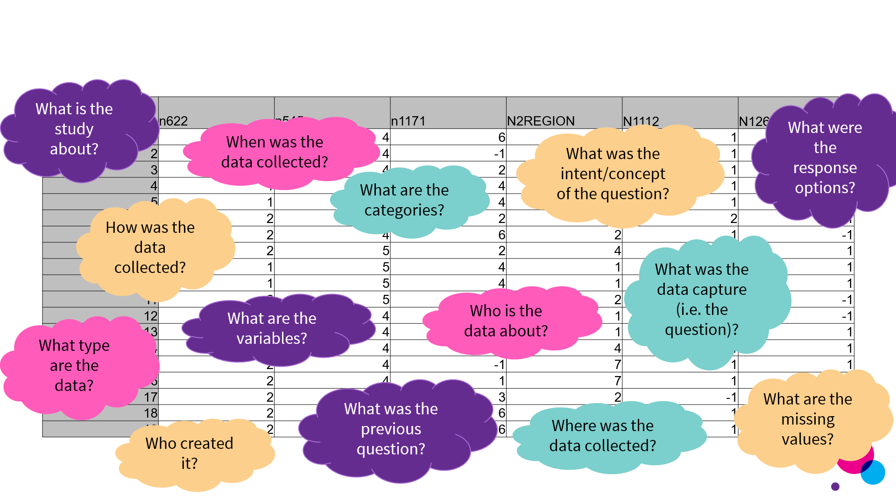

## Intended Learning Outcome

- Define metadata 
- Explain why metadata is important
- Describe the benefits of creating and using metadata

::: notes

This part of the workshop will explain what metadata is, why it’s important, and what the benefits are to you as a researcher

:::

---

## Outline

- What is metadata?
- Metadata in everyday life
- “Sam1” video
- Exercise 2: What information is needed to understand and use data?
- Roles of metadata
- Why is metadata important?
- Benefits of metadata
- Summary

::: notes

:::

---

## What is metadata? (1)

- “Data about data”, or “simply data about data” [2]
- Wikipedia “data that provides information about other data, but not the content of the data itself” [3]
- Parry (2023) writes “metadata is NOT data about data” [4]
- Opinions vary, but everyone agrees that metadata has some relationship to data
  - Provides a framework to describe and understand data, so that it can be used in an intelligent and meaningful way

::: notes

If you’ve heard of metadata before, you’ll have likely heard the definition “data about data”.
Wikipedia has a slightly different take… (e.g. the date and time of a text message is metadata, but the text of that message is not)
So does a recent paper by Kyle Parry… (it is not just data about data)
Opinions vary, but one thing everyone agrees on is that metadata has a relationship to data – it allows us to make sense of it and use it in an intelligent and meaningful way.

(2) https://dataedo.com/kb/data-glossary/what-is-metadata
(3) https://www.britannica.com/technology/metadata
(4) Parry, K. (2023). Metadata Is Not Data About Data. Decolonizing Data, p15-33

:::

---

## What is metadata (2)

- Is machine-readable, unlike textual metadata like a PDF or journal article or a codebook
  - It standardises the content and structure to make it easier for computers to extract information from the metadata
  - It must be structured according to a specific set of rules
- Tells a computer what something is, how it relates to other things (“objects”), and what to do with it
  - Can be provided to researchers to help them discover, understand and access data

::: notes

- Metadata is machine-readable… 
- It categorises things so that computers can understand the meaning of the text - it tells the computer what something is, how it relates to other objects, and what to do with it.
- This information or metadata can be provided to researchers to help them discover, understand and access data

*Note*: A schema is a formal technique for organizing metadata

:::

---

## Metadata in everday life
- Metadata is not exclusive to the research/data context
  

::: notes

- We will have all come across metadata in our everyday lives, because it’s also useful outside of the research/data context.
- Everything you see on the slide are examples of metadata (travel comparison sites, description of a show on Netflix, an online library), so we use metadata all the time without realising.

:::

---

## What is Data (Examples)

| Person  | Sam 1  | Sam 2 | Sam 3  | Sam 4  | Sam 5  |
|---------|--------|-------|--------|--------|--------|
| 1       | 6      |  170  |   165  |        | 140    |              
| 2       | 7      |  200  |        | 250    | 180    |          
| 3       | 18     |  250  |   270  |        | 370    |   
| 4       | 6      |  125  |   140  | 190    | 100    |   
| 5       | 5      |  115  |   170  |        | 275    |
| 6       | 5      |  180  |   170  | 190    | 300    |   

::: notes

- So now we’ve had a look at examples of metadata in everyday life, let’s have a look at metadata in the context of research data.
- On the slide is an example of a dataset with some variables and numbers.
- The first thing you might be asking yourself is, what do the variable names “Sam1”, “Sam2” etc stand for? 
- Dr Judy Benign from NYU also wanted to know the answer to this question, so let’s watch a video to find out how she got on.

:::

---

## Common issues in (meta)data management

[SAM1 Video - Data Management ](https://www.youtube.com/watch?v=N2zK3sAtr-4)

- Most obviously, it applies to data which has been collected for a specific purpose, through a measurement such as Blood Pressure, a Question in a survey or census, or as part of an administrative process and data captured through a device such as a location
- Less obviously it also applies to data such as text, images or sound which is processed into ‘numbers’ for statistical analysis](https://www.youtube.com/watch?v=66oNv_DJuPc 
This scenario might be familiar to you in some way or another, maybe not to this extent, but it highlights some of the key issues in data and metadata management. 

::: notes

:::

---

## Sam1 video reflection

 - What are some of the key (meta)data management issues that the Sam1 video demonstrates?

::: notes

Feel free to raise your hand or shout out if you have any ideas or thoughts.
- In other words, what are some of the problems Dr Judy Benign had when trying to access the data?

:::

---

## Key (meta)data management issues from Sam1 video

- Secure data storage
- Data not archived
- File formats and software
- Variable-level information
- No researcher identifier
- Submitting to an archive
- Sharing with your future self

::: notes

- The researcher created a dataset, but with no prior thought about how to describe where it is, what it is about, how to use it, or where it came from, to someone else (or themselves!) 
- Metadata provides the information to do this. 

:::

---

## Exercise 2: What information is needed to understand and use this data

|          | N662   | N545  | N1171  | N2REGION | N1112  | N1261 |
|----------|--------|-------|--------|----------|--------|-------
| 1        | 2      |  4    | 6      | -2       | 1      | 1            
| 2        | 1      |  4    | -1     | 1        | 1      | 1        
| 3        | 1      |  4    |  4     | 10       | 1      | 1 
| 4        | 1      |  4    |  4     | 4        | 1      | 1  
| 5        | 1      |  4    |  4     | 4        | 1      | 1  
| 6        | 2      |  4    |  2     | 1        | 2      | 1  
| 7        | 2      |  4    |  6     | 2        | 1      | -1  
| 8        | 2      |  4    |  2     | 4        | 1      | 1  
| 9        | 1      |  4    |  4     | 1        | 1      | 1  
| 10       | 1      |  4    |  4     | 1        | 1      | 1  
| 11       | 2      |  4    |  3     | 2        | -1     | -1  
| 12       | 2      |  4    |  -1    | 1        | -1     | -1  
| 13       | 1      |  4    |  3     | 1        | 1      | 1  
| 14       | 2      |  4    |  2     | 4        | 1      | 1  
| 15       | 2      |  4    |  -1    | 7        | 1      | 1  
| 16       | 2      |  4    |  1     | 7        | 1      | 1  
| 17       | 2      |  4    |  3     | 2        | -1     | 1  
| 18       | 2      |  4    |  6     | 2        | 1      | 1  
| 19       | 2      |  4    |  6     | 10       | 1      | 1  

::: notes

- Let’s have a look at more of a contextualised example of how metadata can help us to understand and use data.
- On the slide is a screenshot of a dataset. 
- With the people on your table, please take a couple of minutes to discuss what information you would need in order to be able to understand and use this data.

*Study: [National Child Development Study](https://closer.ac.uk/cross-study-data-guides/cognitive-measures-guide/ncds-cognition/ncds-age-7-copying-designs-test/)
Sweep: [Age 7 Survey (1965)](https://discovery.closer.ac.uk/item/uk.cls.ncds/0103e4b4-09a6-41a8-997b-3ca0b1edcafc)
Data file: [NCDS1 Parental Questionnaire (1965) Dataset](https://discovery.closer.ac.uk/item/uk.cls.ncds/4e8b2fc7-00bd-4783-8445-ef451de69cf5/1)*

:::

---

## Example questions to understand and use data

::: notes

- Here are just some of the questions we would need to answer to be able to find, understand, and use the data.
- First and foremost, we need to know who collected the data? What data did they collect? When was it collected? Where was it collected? And how was it collected? - One way to think about metadata is that it is the who/what/where/when/how of the data.
- Having this metadata helps to provide additional context about the data. For example, knowing how the data was collected (for instance, whether the data is a self-report vs. physical measurement) helps us to assess how valid and accurate the data is.
- This example shows us how metadata is necessary to understand someone else’s data, but it’s also good to consider how this information might be useful for your future self when working on your own data, so you don’t end up in a Sam1 situation!
- Capturing this information (or metadata) means that the data is available for re-use, and it also makes it machine-actionable to make data management easier and more efficient, and the data more discoverable. 

:::

---

## Roles of metadata

- Metadata supports three main uses:
 - Understandability and context - it helps to convey the meaning of resources
 - Use and action - it describes the limits of reasonable use or what actions can be taken
 - Discovery - it helps people to find relevant resources

::: notes

:::

---

## Why is metadata important?

- Metadata is the core component of Research Data Management (RDM)
  - RDM is the “storage, access and preservation of data created or collected in the course of research” [6]
- It may be required by...
  - Institutes (in your working contract or project agreements)
  - Funding agencies (ensure reusability and meet FAIR requirements)
  - Journals (as a condition for publishing)
  - Supervisors (data citation to enhance researcher reputation)
  - Projects (collaboration across agencies/organisations)

::: notes

So far, we’ve described what metadata is. But why is it important?
Metadata is the core component of RDM, which is the …
There are several external reasons why we might be required to document metadata…

(6) CODATA RDM Terminology Working Group. (2024). CODATA RDM Terminology (2023 version): overview (Version 2023). Zenodo. https://doi.org/10.5281/zenodo.10626170

:::

---

## Benefits of metadata for you

- Preserves resources
- Helps your future self understand and reuse the data
- Helps others find, understand, compare, and use your data
- More accurate, higher-quality research results
- Open science - proof of transparent and valid conduct

::: notes

As well as external factors, metadata is helpful for your future self, to help you understand your data later down the line, and be able to share it in a meaningful way with others.

:::

---

## Summary

- Metadata is information that describes data
- Metadata is based on a structure that can be processed by a computer 
- Metadata is important for your future self and others to discover, understand and use data
- Metadata allows researchers to use data effectively because it includes the important information needed to exploit the full potential of data

::: notes

:::

---

## Questions?
